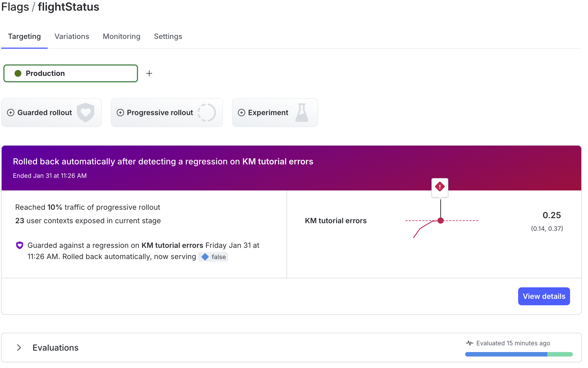

# LaunchDarkly Node Guardian Rollout

This is a sample application that can be configured to invoke an automated rollback on LaunchDarkly when a feature is released with a guarded rollout. A Guardian Edition account is required.

This application is for demonstration purposes only and is not designed to serve production code.




# Tech

This is a node express app, basic javascript, css and html in addition to the LaunchDarkly node sdk. For convience, nodemon is also used.

# Endpoints

- `/` will serve a static page (also available at `/public/ab.html`) where the demo can be run
- `/flag` will make a request to possibly generate an error
- `/errorrate` will adjust the error rate for the select group (treatment or control)
- `/resetcounter` will reset the graph data points to 0
- `/interval` will let the server know when the next request will occur. 

# Runtime Start Configurations

The following values are required for the demo to work

- `LAUNCHDARKLY_SDK_KEY` a value set by LaunchDarkly that can be found in the project settings. The key is specific to the environment being demo'd.
- `LAUNCHDARKLY_METRIC_KEY` a value defined in the LaunchDarkly project that can be used in the rollout to determine the quality of the release. Should LaunchDarkly deem the rollout to be a regression it will rollback the release. Be sure to use the event key of the metric.
- `LAUNCHDARKLY_FLAG_KEY` The key of the flag for the release.

`Note:` For a simple example use a boolean feature flag.

`Note:` When defining a metric use `Occurrence`, `users` and `lower is better`. This example application rotates the user per request.

A typical invocation of the application would be:

```
LAUNCHDARKLY_SDK_KEY='my-sdk-key' LAUNCHDARKLY_FLAG_KEY='my-feature-flag' LAUNCHDARKLY_METRIC_KEY='my-custom-metric' npm run dev

```

# Dynamic Configuration and Demo Actions

- This demo can be started with the `Start Testing` button on the home page
- This demo can be ended with the `End Testing` button on the home page
- This demo can be reset (not the guardian rollout) to 0 with the `Reset Graph` button. 
- The frequency of error requests can be set changed. Allowed values can be between 100ms and 1000ms in 100ms increments. The test does not have to stopped to adjust this value
- The error rate for the treatment group can be change to values between 5% and 100%. It is recommended to set this value high to see a rollback. The test does not have to stopped to adjust this value
- The error rate for the control group can be change to values between 5% and 50%. It is recommended to set this value low to see a rollback. The test does not have to stopped to adjust this value